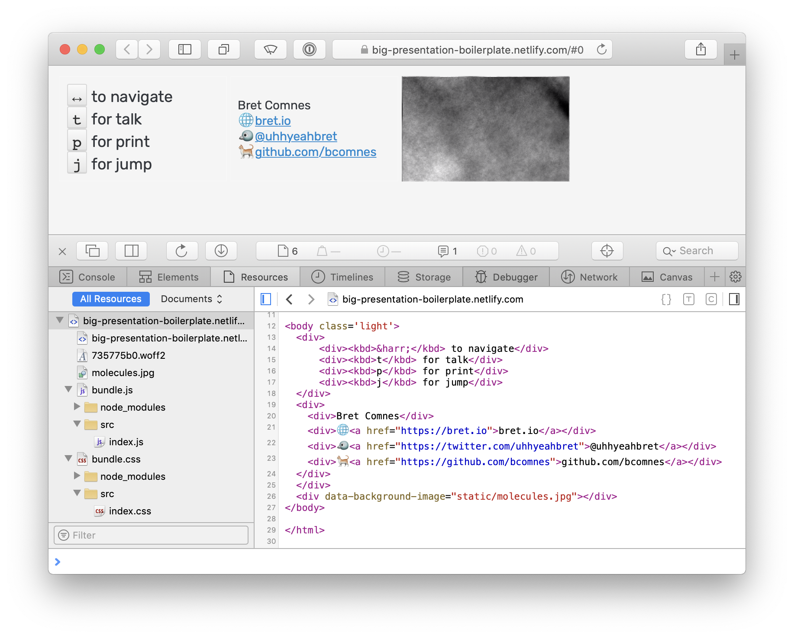

# big-presentation-boilerplate

My [tmcw/big](https://github.com/tmcw/big) presentation setup, ready to fork.




```
$ npm i
$ npm start
```

Then edit your slides.

- Static assets go in [`src/static`](src/static).
- Your [big](https://github.com/tmcw/big) slides go into [`src/index.html`](src/index.html)
- [`src/index.js`](src/index.js) is your app entrypoint.  Do whatever!
- [`src/index.css`](src/index.css) is your style entrypoint.  Go hog wild!

Compatible with netlify:

- Command: `npm run build`
- Folder: `site`
